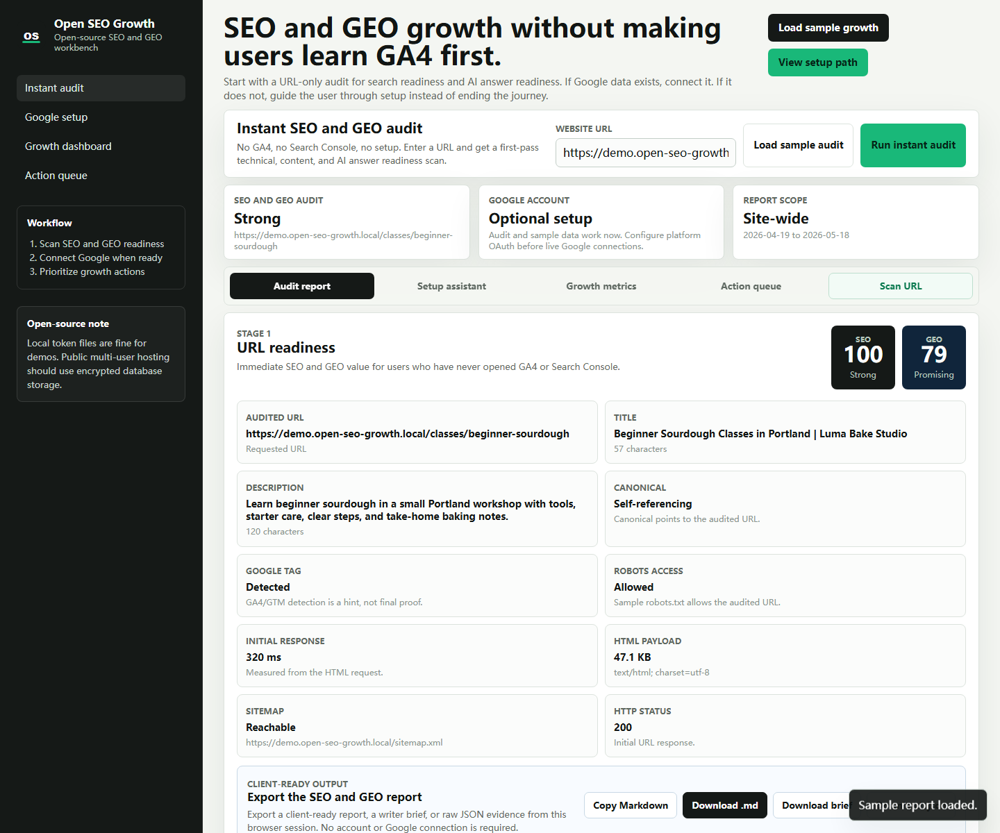

# Open SEO Growth

A runnable open-source Flask app for instant SEO/GEO audits, beginner Google setup, and GA4/Search Console growth analysis.

Open SEO Growth is my first open-source project as a beginner learning with vibe coding. Feedback, issues, ideas, and suggestions are very welcome. Thank you for taking a look.

Open SEO Growth helps a site owner answer a practical question:

> "What can I run right now, before I understand GA4 or Search Console?"

The app starts with a URL-only SEO and GEO audit that works without Google setup. When Google access exists, it can connect through OAuth, discover Search Console and GA4 properties, and turn clicks, impressions, CTR, average position, sessions, and channel mix into prioritized growth actions.

Runtime screenshot captured from the running Flask app at `http://127.0.0.1:8792` after loading the sample audit and sample growth report:



## What You Can Run Today

- Instant URL audit with no Google setup, including HTTP status, canonical target, response timing, HTML payload, and exact robots.txt access evidence
- GEO readiness scan for crawlable text, answer structure, schema, trust signals, freshness, references, and optional `llms.txt`
- Prompt-safe GEO writer brief generated from audit evidence
- Client-ready Markdown export and JSON evidence export from the browser, including technical response evidence
- Built-in sample audit for demos without network, Google, or a real website
- No-Google starter report for beginners
- Clickable sandbox flow for the Google setup journey
- Platform readiness checklist for OAuth, redirect URI, HTTPS mode, secret key, and token storage
- Google OAuth connection flow
- Automatic Search Console property discovery
- Automatic GA4 property discovery
- Search Console clicks, impressions, CTR, and average position
- GA4 sessions, landing pages, channel mix, events, and revenue signals
- Ranking opportunities, CTR rewrite queue, page priority queue, and ranking distribution
- Client-ready growth report export for Search Console and GA4 metrics
- CSV and Markdown action queue export for implementation handoff
- Sample growth dashboard mode for demos and product validation

## Local Demo

After starting the app, open `http://127.0.0.1:8792` and try these controls:

1. Click `Load sample audit` to see the SEO/GEO audit without entering a URL.
2. Click `Run instant audit` after entering a real public URL.
3. Click `Copy Markdown`, `Download .md`, `Download brief`, or `Download .json` after an audit runs.
4. Click `Start demo setup` in the Google setup assistant to walk through the beginner flow.
5. Copy the platform readiness checklist before configuring a hosted Google connection.
6. Click `Load sample growth` to see the growth dashboard without Google OAuth.
7. Export the growth report as Markdown or JSON after sample or live Google data loads.
8. Export the action queue as CSV or Markdown for client, writer, or developer handoff.
9. Click `Connect Google` only when you have a Google Cloud OAuth client and access to real GA4/Search Console properties.

## Quick Start

```bash
git clone https://github.com/Lumo016/open-seo-growth.git
cd open-seo-growth
python -m venv .venv
```

On Windows PowerShell:

```powershell
.\.venv\Scripts\pip install -r requirements.txt
Copy-Item .env.example .env
.\.venv\Scripts\python app.py
```

On macOS or Linux:

```bash
source .venv/bin/activate
pip install -r requirements.txt
cp .env.example .env
python app.py
```

Open:

```text
http://127.0.0.1:8792
```

You can use Instant audit, Load sample audit, Setup assistant, Sandbox demo, and Load sample growth without Google OAuth.

The audit screen can export:

- a client-ready Markdown report
- a standalone GEO content brief for writers
- raw JSON audit evidence
- a clipboard-ready Markdown report

The growth dashboard can export:

- a client-ready Markdown growth report
- raw JSON growth evidence
- a clipboard-ready Markdown growth summary

The action queue can export:

- CSV tasks for spreadsheets or project management tools
- Markdown tasks for client handoff or issue creation

## Development Checks

```bash
pip install -r requirements-dev.txt
python -m py_compile app.py seo_growth/*.py
python -m pytest -q
node --check static/app.js
```

## GEO Readiness

The instant audit includes a Generative Engine Optimization readiness report. It checks whether a page is understandable, structured, and citable enough for AI answer surfaces:

- crawlable visible content
- clear title and H1 topic signals
- structured data types such as `Organization`, `WebSite`, `Article`, `Product`, `FAQPage`, or `HowTo`
- question or answer-oriented sections
- trust signals such as author, organization, about, contact, privacy, sources, or editorial references
- published or updated date signals
- external references where appropriate
- indexability, robots meta, and exact robots.txt URL access
- optional `/llms.txt`

This score is a heuristic, not a guarantee of AI citation, inclusion, or ranking. See [docs/geo-readiness.md](docs/geo-readiness.md).

## Google Setup

Live Google metrics require a Google Cloud OAuth client and user access to the target GA4 and Search Console properties.

1. Create a Google Cloud project.
2. Enable these APIs:
   - Google Search Console API
   - Google Analytics Data API
   - Google Analytics Admin API
3. Create an OAuth client:
   - Application type: Web application
   - Local redirect URI: `http://127.0.0.1:8792/auth/google/callback`
   - Cloud redirect URI: `https://your-domain.com/auth/google/callback`
4. Copy the client ID and secret into `.env`.
5. Make sure the signing Google account has:
   - Search Console access to the site property
   - GA4 Viewer access to the property

The app then calls Search Console `sites.list` and GA4 Admin `accountSummaries.list` to fill the property selectors.

The setup assistant includes a platform readiness checklist. It shows whether the current deployment is ready for local OAuth testing, whether hosted HTTPS mode is configured, and why file-based token storage must be replaced before multi-user SaaS hosting.

## Environment

```env
FLASK_SECRET_KEY=change-me
APP_BASE_URL=http://127.0.0.1:8792
GOOGLE_CLIENT_ID=
GOOGLE_CLIENT_SECRET=
GOOGLE_REDIRECT_URI=http://127.0.0.1:8792/auth/google/callback
TOKEN_STORE_DIR=instance/oauth_tokens
ALLOW_INSECURE_OAUTH=1
ANALYTICS_REPORT_DAYS=30
ANALYTICS_DATA_LAG_DAYS=2
GSC_OPPORTUNITY_MIN_IMPRESSIONS=20
```

Use `ALLOW_INSECURE_OAUTH=1` only for local HTTP development. Cloud deployments should use HTTPS and remove it.

## Project Structure

```text
open-seo-growth/
  app.py                       Flask entrypoint
  seo_growth/
    app.py                     Routes and API endpoints
    analytics.py               Google API calls and demo report
    config.py                  Environment settings
    google_oauth.py            OAuth flow and local token store
    instant_audit.py           URL-only SEO and GEO readiness audit
    opportunities.py           SEO opportunity scoring
  templates/
    index.html                 Single-page workbench UI
  static/
    app.js                     Frontend state and interactions
    styles.css                 Product UI styles
    assets/                    Logo
  tests/                       Pytest coverage for audit and API behavior
  docs/
    beginner-google-setup.md   Beginner flow and launcher model
    geo-readiness.md           GEO scoring model and limits
    google-api-notes.md        Google API details
    runtime-demo.md            Runtime screenshot and demo verification notes
```

## API Endpoints

- `GET /api/session`
- `GET /auth/google/start`
- `GET /auth/google/callback`
- `POST /auth/logout`
- `POST /api/audit`
- `GET /api/connections`
- `POST /api/analyze`

Run URL audit:

```json
{
  "url": "https://example.com"
}
```

Run the built-in sample audit:

```json
{
  "demo": true
}
```

Run live or demo analysis:

```json
{
  "gsc_site_url": "https://example.com/",
  "ga4_property_id": "123456789",
  "target_url": "https://example.com/blog/page",
  "days": 30,
  "lag_days": 2
}
```

Use `"demo": true` to load seeded demo data.

## Security And Privacy

Do not commit `.env`, OAuth token files, analytics exports, customer reports, or private site data. The repository includes only `.env.example` placeholders. Runtime token files are written under `instance/`, which is ignored by Git.

The bundled `FileTokenStore` is fine for local demos and private single-user trials. A public multi-user deployment should replace it with encrypted database-backed token storage plus user accounts, workspace membership, rate limiting, and stronger OAuth state handling.

## Contributing

Contributions are welcome. Start with [CONTRIBUTING.md](CONTRIBUTING.md), open an issue for larger changes, and avoid committing real analytics data or OAuth tokens.

## License

MIT. See [LICENSE](LICENSE).
